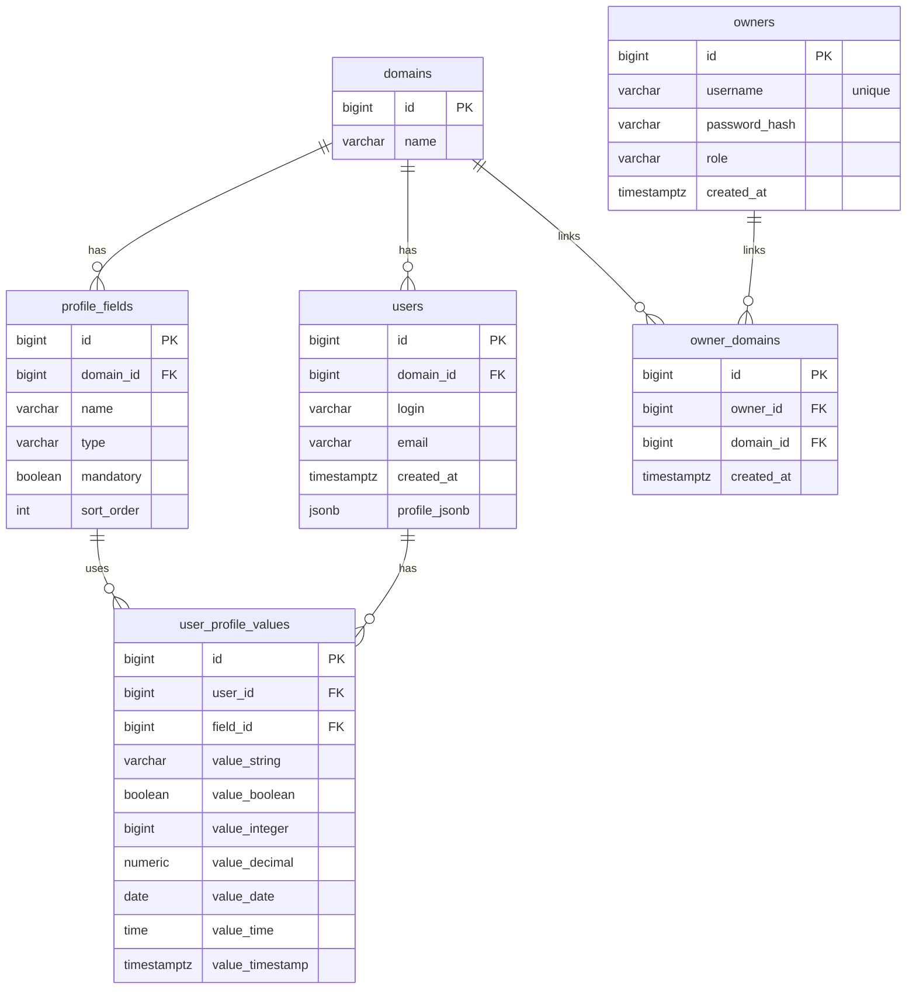

# userid-be

Auth service for domain-based user registration with dynamic profile fields.

## ERD (PostgreSQL)

### Indexes (core for fast fetch)
- `profile_fields (domain_id, name)` unique for schema lookup by domain.
- `users (domain_id, login)` unique for user lookup per domain.
- `user_profile_values (user_id)` for fast fetch of user profile.
- `user_profile_values (field_id, value_*)` per-type composite indexes for fast filtering.

## API

### Domains
- `POST /api/domains` (ADMIN must pass `ownerId`, USER creates domain for self)
- `GET /api/domains`
- `PUT /api/domains/{domainId}`
- `DELETE /api/domains/{domainId}`

### Profile fields per domain
- `POST /api/domains/{domainId}/profile-fields`
- `GET /api/domains/{domainId}/profile-fields`
- `PUT /api/domains/{domainId}/profile-fields/{fieldId}`
- `DELETE /api/domains/{domainId}/profile-fields/{fieldId}`

### Users
- `POST /api/domains/{domainId}/users` - register user with profile values
- `GET /api/domains/{domainId}/users/{userId}` - fetch user with profile values
- `POST /api/domains/{domainId}/users/search` - filter users by profile values
- `PUT /api/domains/{domainId}/users/{userId}`
- `DELETE /api/domains/{domainId}/users/{userId}`

### Owners (access control)
- `POST /api/auth/login` - login owner (returns JWT)
- `POST /api/owners` - create owner (admin only)
- `GET /api/owners` - list owners (admin only)
- `GET /api/owners/{ownerId}` - get owner (admin or self)
- `POST /api/owners/{ownerId}/domains` - link domain to USER (admin only)
- `PUT /api/owners/{ownerId}`
- `DELETE /api/owners/{ownerId}`
- `DELETE /api/owners/{ownerId}/domains/{domainId}`

## Notes
- Each profile value row stores a single typed value, enforced in service validation.
- Search is implemented as `EXISTS` subqueries per filter to use `field_id + value_*` indexes.
- `users.profile_jsonb` stores a denormalized snapshot of profile values and is used for user fetch responses.
- Each domain has a single owner (USER). Different owners can reuse domain names.
- Requests must include `Authorization: Bearer <JWT>` for access checks (admin vs domain-linked user).
- Default auth service port: `8282` (override with `PORT`).
